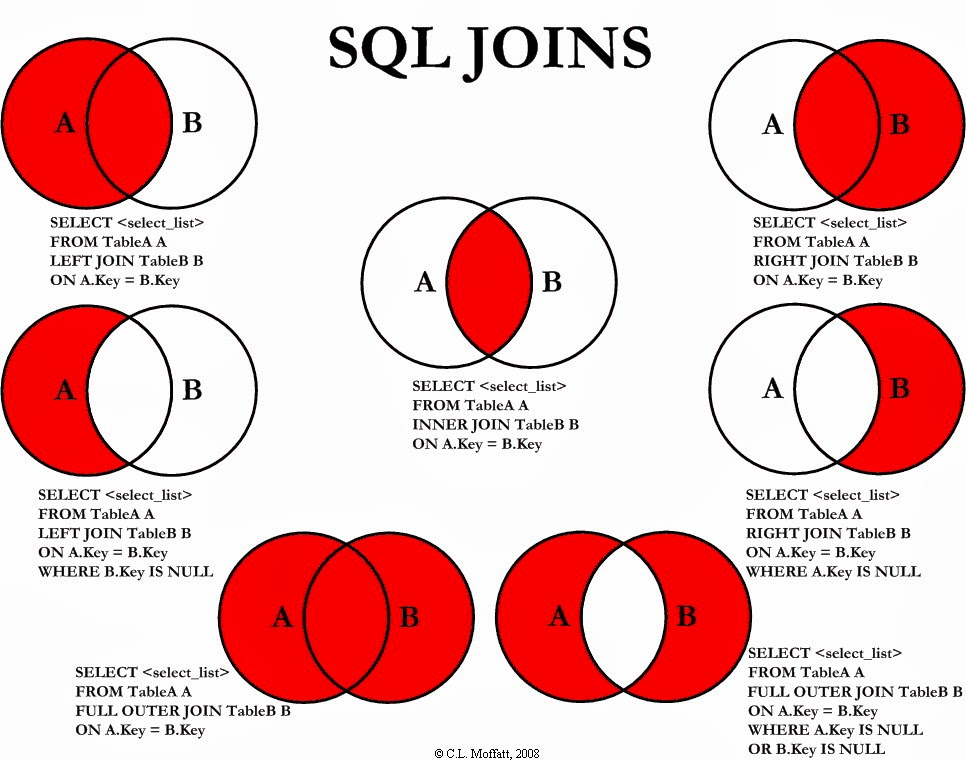

<details>
 <summary>Query</summary>


<details>
<summary>Query Clause Order</summary>

## Query Clause Order

### Complete `SELECT` query
```sql
SELECT DISTINCT column, AGG_FUNC(column_or_expression), ...
FROM my_table
    JOIN another_table
    ON my_table.column = another_table.column

    WHERE
        -- contraint expression
    GROUP BY
        column
        -- grouping by column or columns
    HAVING
        -- constraint expression for GROUP BY
    ORDER BY
        column ASC/DESC
    LIMIT
        count
    OFFSET
        count
```


### 1. `FROM` and `JOIN`s 

The `FROM` clause and subsequent `JOIN`s are first executed to determine the
working set of data to be queried. This can includes subqueries in this clause,
and can cause temporary table to be created under the hood containning all the
columns and rows joined.

### 2. `WHERE`

Each of the `WHERE` constraints can only be access columns directly from table
requested in the `FROM` clause. 

Aliases in the `SELECT` part of the query are not accessible in most databases
since they may include expressions dependent on parts of the query that have
not yet executed. 

### 3. `GROUP BY` 

The remaining rows after `WHERE` constraints are applied are then grouped based
on common values in the column specified by `GROUP BY` clause.

As a result of the grouping, there will only be as many rows as there are
unique values in that column. 

Implicitly, this means that you should only need ot use this when you have
aggregrate functions in your query.

### 4. `HAVING`

If the query has a `GROUP BY` clause, then the constraints in the `HAVING`
clause are then applied to the grouped rows, discard the grouped rows that
don't satisfy this constraint. 

Like the `WHERE` clause, aliases are not accessible from this step in most
database. 

### 5. `SELECT` 

Any expression in the `SELECT` part of the query are finally computed. 

### 6. `DISTINCT`

Of the remaining rows, rows with duplicate values in the column marked as
`DISTINCT` will be discarded.


### 7. `ORDER BY` 

If an order is specified by the `ORDER BY` clause, the rows are then sorted by
the specified data in either ascending or descending order. Since all the
expression in the `SELECT` part of the query have been computed, you can
reference aliases in this clause.


### 8. `LIMIT` / `OFFSET` 

Finally the rows that fall outside the range specified by the `LIMIT` and
`OFFSET` are discarded, leaving the final set of rows to be returned from the
query.
</details>

> Not all query needs to have all parts of the query listed above. 
</details>

<details>
<summary>Differences between WHERE and HAVING BY</summary>

### Differences between `WHERE` and `HAVING BY`

`HAVING` block illustrates the filtering of result based on grouping and
aggregration. 

`WHERE` block illustrates the filtering of result **before** grouping and
aggregration. 
</details>

## Pattern Matching 
Pattern matching uses keyword `LIKE` and (`%` and `_`) wildcard symbols.

`%` wildcard matches zero or more characters of any type. The wildcard can be
used before, after, or both (before and after) the pattern. 

`_` wildcard matches any character for one character position. 

- First name beginning with letter A
```sql
SELECT
    *
FROM
    students
WHERE
    first_name LIKE "A%"
```

- Omitting patterns using `NOT` keyword
```sql
SELECT
    *
FROM
    students
WHERE
    first_name NOT LIKE "%A%"
```

- Specific location  using `_` wildcard - third character is `A`
```sql
SELECT
    *
FROM
    students
WHERE
    first_name LIKE "__A%"

```
- n or more letters - 4 or more letters
```sql
SELECT
    *
FROM
    students
WHERE
    first_name LIKE "____%"

```

- exactly n letters - exactly 4 letters
```sql
SELECT
    *
FROM
    students
WHERE
    first_name LIKE "____"

```


## Nested Queries

Nesting is necessary in the `WHERE` clause because the interpreter is unable to
look outside to figure out any aggregration function. 

Example, 

```sql
SELECT
    first_name,
    last_name
FROM 
    executions
WHERE
    LENGTH(last_statement) = (SELECT MAX(LENGTH(last_statement) FROM executions)
```

## MapReduce


> MapReduce is a famous programming paradigm which views computations as
> occuring in a "map" and "reduce" step. 

According to the [Simple MapReduce explanation](https://stackoverflow.com/questions/28982/simple-explanation-of-mapreduce),

> **Map** is a function that transforms each element in the data. 

```python
A = [1, 2, 3]
A = map(lambda x: x * 2, A)
print(A)
```
```text
[2, 4, 6]
```

> **Reduce** is a function which "collects" items in the data and perform some
> computation on all of them. Thus reducing them into a single item. 

```python
from functools import reduce
total = reduce(lambda x, y: x + y, range(1, 11))
>>> total
```
55

## View

A view is a logical snapshot based on a table or another view. It is used 
- Restricting access to data
- Making complex queries simple
- Ensuring data independency
- Providing different views of same data


## SQL Joins 



At the top level, there are mainly 3 types of joins:

- `INNER`
    - fetches data if pressent in both the tables

- `OUTER`
    - `LEFT OUTER JOIN` fetches data if present in the left table.

    - `RIGHT OUTER JOIN` fetches data if present in the right table.

    - `FULL OUTER JOIN` fetches data if present in the either of the two table.

- `CROSS`
    - as the name suggets, does `[n X m]` that joins everything to everything. 

    - Similar to scenario where we simply lists the tables for joining (in the
      `FROM` clauses of the `SELECT` statement), using commas to separate them


**Points to be noted:**

- If you mention `JOIN`, then by default it is a `INNER JOIN`.

- An `OUTER` join has to be `LEFT` | `RIGHT` | `FULL` you can not simply say `OUTER JOIN`

- You can drop `OUTER` keyword and just say `LEFT JOIN` or `RIGHT JOIN` or
  `FULL JOIN`. 

 


> What is the differences between `LEFT JOIN` and `LEFT OUTER JOIN`?

**Nothing**. `LEFT JOIN` and `LEFT OUTER JOIN` are equivalent. 


**Points to note on Venn Diagram**

Venn diagrams are helpful to illustrates the differences in output rows if
tables has no nulls or duplicate rows. 

However, if table contains null and duplicate rows, then a Venn diagram is
difficult to explain. 

Read [Stackoverflow post on why Venn Diagram isn't help to illustrate nulls.](https://stackoverflow.com/a/38578)


## Common Table Expressions 
The only way to declare variables in SQL


## Window Function

```sql
-- Aggregrations / rankings on a subset of rows relative to the current row being transformed by SELECT

function (...) OVER (
    PARTITION BY ...
    ORDER BY ...
    ROWS BETWEEN ... AND ...
)
```

### Getting a running total 
Given table `Accounts` with columns `event_date`, and `amount`. Find the running total
at each `event_date`.

```sql
SELECT 
    event_date,
    SUM(amount) over (ORDER BY event_date ASC) AS running_total
FROM
    Accounts
ORDER BY
    event_date ASC
```

### Populate total count in each row
```sql 
SELECT 
    whatever_columns,
    COUNT(*) OVER() as total_count 
FROM
    table
```

### Getting the N most recent rows over mutliple goruping
```sql
WITH CTE AS (
    SELECT 
        *,
        ROW_NUMBER() OVER (PARTITION BY user_id 
                           ORDER BY completion_date DESC) AS rn
    FROM
        Table


SELECT * FROM CTE WHERE rn <= n 
)
```

`ROW_NUMBER` is a function. 


## References 

- [Select Star SQL](https://selectstarsql.com)
- [Select first row in each GROUP BY group?](https://stackoverflow.com/questions/3800551/select-first-row-in-each-group-by-group)
- [SQL Window Functions](https://mode.com/sql-tutorial/sql-window-functions/)
- [PostgreSQL: optimizing DISTINCT](https://explainextended.com/2009/05/03/postgresql-optimizing-distinct/)
- [10 SQL Tricks That You Didn't Think Were Possible](https://de.slideshare.net/LukasEder1/10-sql-tricks-that-you-didnt-think-were-possible/)
- [SQLBolt - Learn SQL with simple, interactive exercises](https://sqlbolt.com)
- [LeetCode Curated SQL 70](https://leetcode.com/problemset/leetcode-curated-sql-70/)
- [w3schools.com](https://www.w3schools.com/sql/default.asp)


